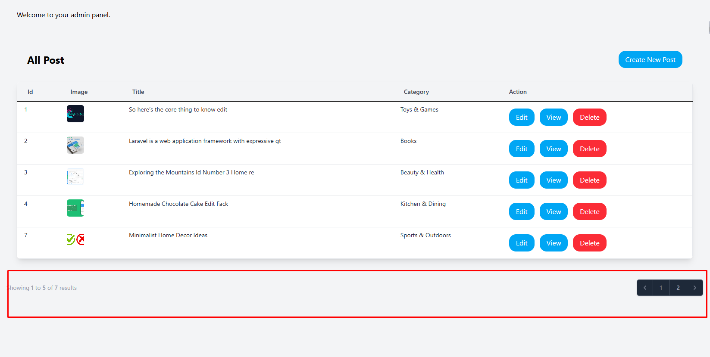
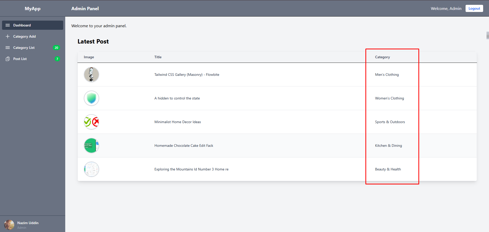
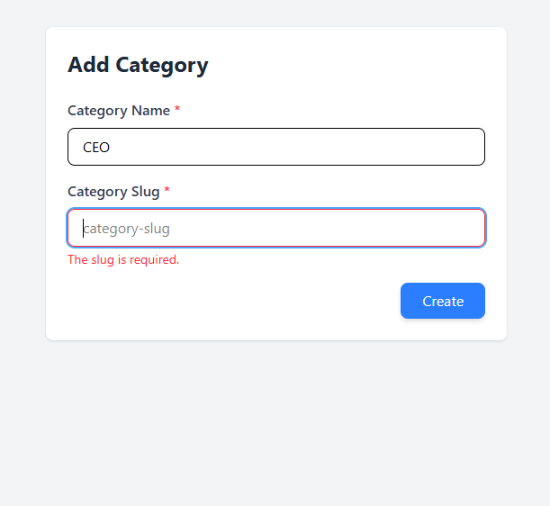
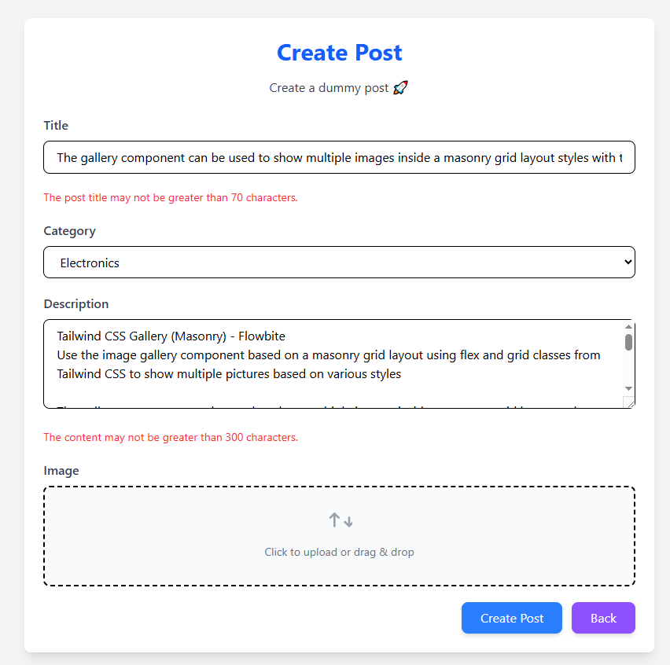
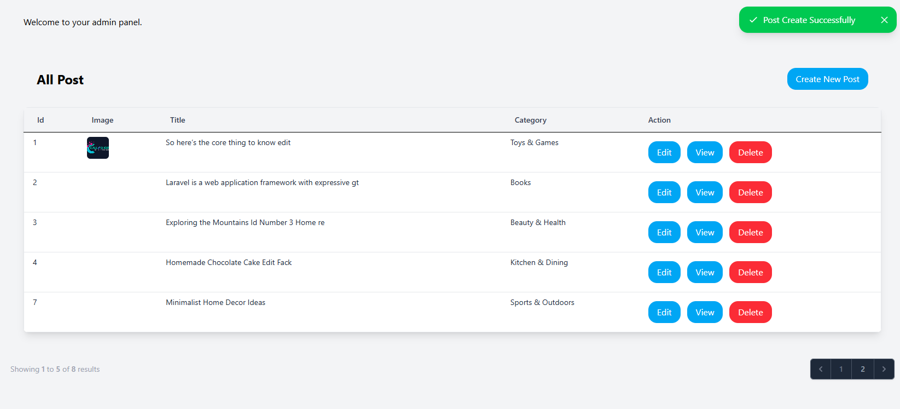

<p align="center"><a href="https://laravel.com" target="_blank"></a></p>

<p align="center">
<a href="https://github.com/laravel/framework/actions"></a>
<a href="https://packagist.org/packages/laravel/framework"></a>
<a href="https://packagist.org/packages/laravel/framework"></a>
<a href="https://packagist.org/packages/laravel/framework"></a>
</p>

## Laravel Assignment-2 (Form Handling & Eloquent Relationship)

এই প্রজেক্টে Laravel FormRequest, Eloquent Relationship (hasMany / belongsTo), Pagination, এবং Blade ব্যবহার করে একটি ছোট ব্লগ সিস্টেম তৈরি করা হয়েছে। ডকুমেন্টেশনটিতে সব বিস্তারিত দেওয়া হল -


## Project Structure:

    ```
        app/
            Http/
                Controllers/
                CategoryController.php
                PostController.php
            Requests/
                CategoryStoreRequest.php
                PostStoreRequest.php
            Models/
                Category.php
                Post.php
        resources/
            views/
                layouts/
                    app.blade.php # মাস্টার লেআউট
                categories/
                    categories.blade.php # ফর্ম 
                    category-list.blade.php # লিস্ট (pagination)
                partials/
                    footer.blade.php
                    header.blade.php
                    sidebar.blade.php
                posts/
                    index.blade.php # লিস্ট (pagination)
                    create.blade.php # ক্রিয়েট ফর্ম
                    edit.blade.php #Edit ফর্ম 
                    item.blade.php #পোস্ট ভিউ পেইজ 
                    
                dashboard.blade.php # ক্যাটাগরি + পোস্ট ভিউ
        routes/
            web.php
    ```


## Feature summary:

* ✅ Category Create (name, slug) — FormRequest দিয়ে ভ্যালিডেশন, slug unique।

    ```php
        public function rules(): array
        {
            return [
                //
                'name' => 'required|string|max:20',
                'slug' => 'required|string|max:20|unique:categories,slug'
            ];
        }
    ```
  - Create Custom Validation Error Messages
  ```php 
  public function messages(): array
    {
        return[
            // name field
            'name.required' => 'The category name is required.',
            'name.string'   => 'The category name must be a string.',
            'name.max'      => 'The category name may not be greater than 20 characters.',

            // slug field
            'slug.required' => 'The slug is required.',
            'slug.string'   => 'The slug must be a string.',
            'slug.max'      => 'The slug may not be greater than 20 characters.',
            'slug.unique'   => 'The slug has already been taken, please choose another one.',
        ];
    }
  ```

  


- Category Model 
    ```php
    
    <?php
    
    namespace App\Models;
    use Illuminate\Database\Eloquent\Model;
    
    class Categorie extends Model
    {
        
        protected $fillable = [
            'name','slug'
        ];
    
        public function post(){
    
            return $this->hasMany(Post::class);
        }
    }
    
    ```
  
- Category migration code 

    ```
    <?php

    use Illuminate\Database\Migrations\Migration;
    use Illuminate\Database\Schema\Blueprint;
    use Illuminate\Support\Facades\Schema;
    
    return new class extends Migration
    {
    /**
    * Run the migrations.
    */
    public function up(): void
    {
        Schema::create('categories', function (Blueprint $table) {
        $table->id();
        $table->string('name');
        $table->string('slug')->unique();
        $table->timestamps();
        });
    }
    
        /**
         * Reverse the migrations.
         */
        public function down(): void
        {
            Schema::dropIfExists('categories');
        }
    };
    ```
  
## Category pagination:

- pagination function: ``10 item per page``

    ```php
    public function show(categorie $categorie)
    {
        //
        $categoriess = categorie::paginate(10);
        return view('content.category-list', compact('categoriess'));
    }
    ```
  
- Paginated Page View:

    

- Others Page View
  
  
  
  
  
  


