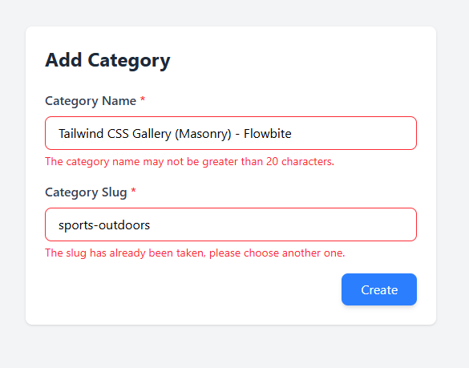

<p align="center"><a href="https://laravel.com" target="_blank"></a></p>

<p align="center">
<a href="https://github.com/laravel/framework/actions"></a>
<a href="https://packagist.org/packages/laravel/framework"></a>
<a href="https://packagist.org/packages/laravel/framework"></a>
<a href="https://packagist.org/packages/laravel/framework"></a>
</p>

## Laravel Assignment-2 (Form Handling & Eloquent Relationship)

এই প্রজেক্টে Laravel FormRequest, Eloquent Relationship (hasMany / belongsTo), Pagination, এবং Blade ব্যবহার করে একটি ছোট ব্লগ সিস্টেম তৈরি করা হয়েছে। ডকুমেন্টেশনটিতে সব বিস্তারিত দেওয়া হল -

## ফিচার সারাংশঃ 

* ✅ Category Create (name, slug) — FormRequest দিয়ে ভ্যালিডেশন, slug unique।

    ```php
        public function rules(): array
        {
            return [
                //
                'name' => 'required|string|max:20',
                'slug' => 'required|string|max:20|unique:categories,slug'
            ];
        }
    ```
  - Create Custom Validation Error Messages
  ```php 
  public function messages(): array
    {
        return[
            // name field
            'name.required' => 'The category name is required.',
            'name.string'   => 'The category name must be a string.',
            'name.max'      => 'The category name may not be greater than 20 characters.',

            // slug field
            'slug.required' => 'The slug is required.',
            'slug.string'   => 'The slug must be a string.',
            'slug.max'      => 'The slug may not be greater than 20 characters.',
            'slug.unique'   => 'The slug has already been taken, please choose another one.',
        ];
    }
  ```

  


